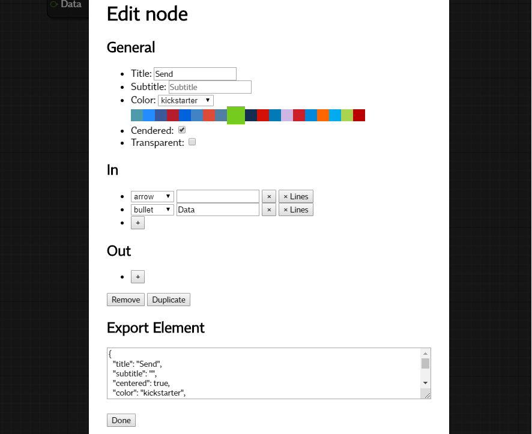

# Node based blueprints visualiser

**EXPERIMENTAL**: Should not be used in Production.




## How to run using docker
Build docker image using:
```
docker build --tag node-based-blueprints .
```

And then run your image:
```
docker run -p 8080:8080 node-based-blueprints
```

Navigate browser to `http://localhost:8080`.

# TODO
- Lines
    - Manipulate lines path.
    - Manipulate lines style (bold, color).
- Canvas
    - Allow multiple selection in canvas.
    - Zoom In / Out.
    - Navigate through canvas with mouse draging.
    - Allow canvas size expasion to all sides.
- Make nested nodes (like transparent one, but they act as one node and can be collapsed).
- Design edit modal box.
